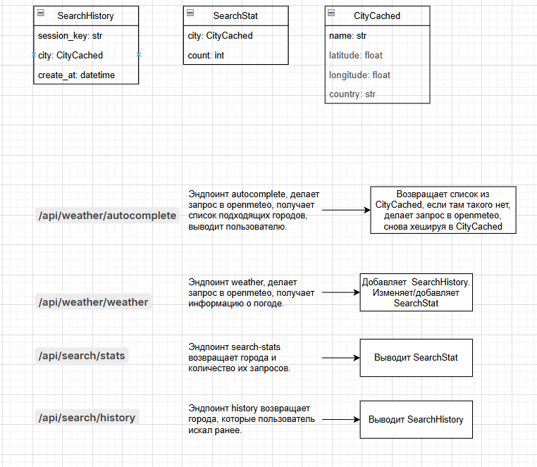

# Weather Forecast Web Application

Веб-приложение для поиска прогноза погоды в городах с автодополнением, историей запросов и статистикой.  
**Используемый API погоды:** [Open-Meteo](https://open-meteo.com/).

---

## 📋 Реализованные функции
- **Поиск погоды** по названию города с выводом данных в удобном формате.
- **Автодополнение** при вводе города (через эндпоинт `/api/weather/autocomplete`).
- **История поиска** для каждого пользователя (на основе `session_key` Django).
- **Статистика запросов** по городам (эндпоинт `/api/search/stats`).
- **Повторное предложение** города при новом посещении.
- **Docker-контейнеризация** для легкого развертывания.
- **Написаны тесты** для проверки корректности работы.

---

## 🛠 Технологии
- **Веб-фреймворк:** Django + Django REST Framework (DRF).
- **Аутентификация:** Сессии Django (включая анонимных пользователей через `session_key`).
- **База данных:** SQLite (по умолчанию, можно заменить на PostgreSQL/MySQL).
- **Дополнительно:** Docker, pytest для тестирования.

---

## 🗃 Структура проекта
### Модели данных
- **`SearchHistory`**  
  `session_key`, `city` (CityCached), `created_at`.
- **`SearchStat`**  
  `city` (CityCached), `count` (количество запросов).
- **`CityCached`**  
  Кэшированные данные города: `name`, `latitude`, `longitude`, `country`.

### API Эндпоинты
1. **`/api/weather/autocomplete`**  
   Возвращает список городов с автодополнением. Использует кэш (`CityCached`) или внешний API.
2. **`/api/weather/weather`**  
   Возвращает прогноз погоды и обновляет историю поиска (`SearchHistory`) и статистику (`SearchStat`).
3. **`/api/search/stats`**  
   Возвращает статистику по количеству запросов для каждого города.
4. **`/api/search/history`**  
   Возвращает историю поиска текущего пользователя.

---

## 📊 Диаграмма взаимодействия компонентов

